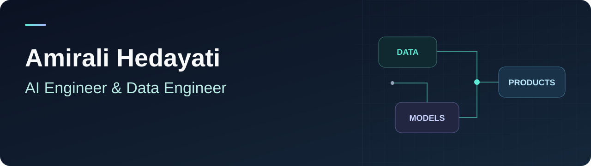

<picture>
  <source media="(max-width: 600px)" srcset="assets/profile-banner-mobile.svg" />
  
</picture>

Applied AI · Reliable pipelines · Useful products

  <a href="https://linkedin.com/in/amirali-hedayati">LinkedIn</a> &nbsp;·&nbsp;
  <a href="mailto:amirali.hedayati@fau.de">Email</a>

  
  
  
  
  
  

## About me

I build AI-powered tools, reproducible data pipelines, and practical web applications, connecting data and models to software people can use.

Currently working at [UKER — Uniklinikum Erlangen](https://www.uk-erlangen.de/en/) on research data pipelines and applied AI.

I'm also a Medical Engineering master's student at **FAU Erlangen-Nuremberg**, specializing in Medical Image and Data Processing. My healthcare and research background shapes my focus on evaluation, data quality, and traceability.

## Projects

<table>
<tr>
<td width="50%" valign="top">
<h3>UKER R Pipeline</h3>

Reproducible dietary-data processing in R, with input-quality checks and traceable Excel reports.

DATA ENGINEERING &nbsp;·&nbsp; RESEARCH

</td>
<td width="50%" valign="top">
<h3>FoodMatch</h3>

Matches free-text food records to food composition databases using LLM ranking, evaluation, and human review.

APPLIED AI &nbsp;·&nbsp; DATA MATCHING

</td>
</tr>
<tr>
<td width="50%" valign="top">
<h3>Almani</h3>

German vocabulary practice for Persian-speaking learners, using spaced repetition and offline study. Built with React and TypeScript.

WEB APPLICATION &nbsp;·&nbsp; EDUCATION

</td>
<td width="50%" valign="top">
<h3>Plotworthy</h3>

Movie and series discovery using live TMDB data, with passwordless sign-in and an account-synced watchlist.

WEB APPLICATION &nbsp;·&nbsp; DISCOVERY

</td>
</tr>
<tr>
<td colspan="2" valign="top">
<h3><a href="https://github.com/amiralihs2/washslot">WashSlot ↗</a></h3>

Dorm laundry reservations with weekly scheduling and booking queues. Built with React, FastAPI, and MongoDB.

<a href="https://washslot.vercel.app">Live demo ↗</a>

FULL-STACK DEVELOPMENT &nbsp;·&nbsp; EVERYDAY PROBLEMS

</td>
</tr>
</table>

More work: [MedEmbed retrieval prototype](https://github.com/amiralihs2/medemed) · [Hybrid recommendation API](https://github.com/amiralihs2/hm-hybrid-recommender-api) · [Customer segmentation & CLV](https://github.com/amiralihs2/customer-segmentation-clv)

## How I work

**Evaluate the AI.** Integrate models into applications and check the quality of their outputs.  
**Make the data traceable.** Transform source data into structured results with quality checks and reproducible processing.  
**Build the whole product.** Connect interfaces, APIs, and databases with clear documentation.

## Technical toolkit

| AI & data | Applications & delivery |
| :--- | :--- |
| **Python · R · SQL** | **TypeScript · JavaScript** |
| LLM integration & evaluation | React · FastAPI · Tailwind CSS |
| scikit-learn · PyTorch · embeddings · FAISS | PostgreSQL · MongoDB |
| Pandas · NumPy · Excel workflows · Power BI | Git · Vercel · Render |

